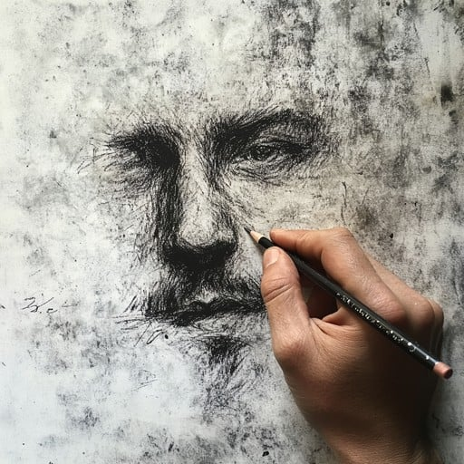

<!DOCTYPE html>
<html lang="en">
<head>
<meta charset="UTF-8">
<meta name="viewport" content="width=device-width, initial-scale=1.0">
<title>Rahul's Drawing</title>

</head>
<body>

<!-- Welcome -->

  <h1>Welcome to my page</h1>
  
Looking for a perfect gift for yourself or your loved ones? Whether it's for a friend or someone special, you can find something unique here!

  <button class="btn" onclick="showPortfolio()">Visit Page</button>

<!-- Portfolio -->

  
  

  <button class="btn" onclick="showOrderForm()">Place Your Order</button>

  <h3>Admin Orders Queue</h3>
  <ul id="orderQueue"></ul>

  <h3>Customer Order Check</h3>
  

    <input type="text" id="checkName" placeholder="Enter your name">
    <button class="btn" onclick="viewMyOrder()">Check My Order</button>
    

  

<!-- Order -->

  <h2>Place Your Order</h2>
  <form id="orderForm" onsubmit="submitOrder(event)">
    <input type="text" placeholder="Your Name" id="name" required> 
    <input type="email" placeholder="Email" id="email" required> 
    <select id="countryCode" required></select> 
    <input type="text" id="phoneNumber" placeholder="Phone Number" required> 
    <textarea id="details" placeholder="Drawing Details" required></textarea> 
    <label>Upload Photo:</label> 
    <input type="file" id="uploadPhoto" accept="image/*" onchange="previewImage(event)"> 
     
    <button type="submit" class="btn">Submit Order</button>
    <button type="button" class="btn" onclick="backToPortfolio()">Back</button>
  </form>

<!-- Cost Confirmation -->

  <h2>Order Cost</h2>
  
Your custom drawing will cost <strong>₹250</strong>.

  <button class="btn" onclick="confirmOrderFinal()">Confirm Order</button>
  <button class="btn" onclick="backToOrder()">Back</button>

<!-- Final Confirmation -->

  <h2>Thank you for your order!</h2>
  
Your order has been received! Please wait, I will contact you soon.

  
Order Number: 

  <button class="btn" onclick="backToPortfolio()">Back</button>

<!-- Lightbox -->

  
  

    <button class="nav-btn" onclick="prevImage(event)">Previous</button>
    <button class="nav-btn" onclick="nextImage(event)">Next</button>
    <button class="close-btn" onclick="closeLightbox(event)">Close</button>
  

</body>
</html>
